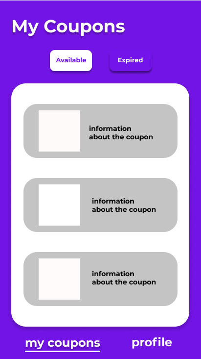

# Funkcionális specifikácó

# Követelményspecifikáció

Ez a követelményspceifikáció az ügyvezetővel készült riport eredménye, még további pontosításra szorul.

# 1. Áttekintés

Egy gyorsétteremlánc számára készítünk mobiltelefonos applikációt Android és IOS rendszerre egyaránt. A program fő funciója, hogy a törzsvásárlóknak egyedi kedvezményeked adhasson az étterem központja, amit az országban bármelyik elfogadóhelyénb érvényesíthetnek, de csak egyszer fejenként. Ezeket az ajánlatokat számítástechnikában felhasználói szintű készséggel rendelkező munkatárs fogja aktiválni.

# 2. Jelenlegi helyzet

Jelenleg semmiféle hasonló rendszer nem működik. A vásárló bemegy az étteremlánc egyik üzletébe, választ a menüről, fizet és távozik.

# 3. Vágyálom rendszer

A vásárló bemegy az üzletlánc egyik éttermébe és a nála lévő mobiltelefonnal igénybe veszi a kedvezményt a vásárlásához, majd választ a menürőlk, fizet és távozik.

# 4. Rendszerre vonatkozó törvények, szabványok, ajánlások

**4.1. Szerzői jogszabályok:**

- A törvény szerint az eredeti számítógépes program az azt létrehozó személy vagy vállalat szellemi tulajdona. A számítógépes programokat szerzői jogi törvény védi, amely kimondja, hogy az ilyen művek engedély nélküli másolása törvénybe ütköző cselekedet. (Magyarországon a szerzői jogokat az 1999. évi LXXVI. törvény szabályozza)
- Licenszerződés(amennyiben van)

**4.2. Adatvédelmi jogszabályok:**

- AZ EURÓPAI PARLAMENT ÉS A TANÁCS (EU) 2016/679 RENDELETE (2016. április 27.) a természetes személyeknek a személyes adatok kezelése tekintetében történő védelméről és az ilyen adatok szabad áramlásáról, valamint a 95/46/EK rendelet hatályon kívül helyezéséről (általános adatvédelmi rendelet)
- évi CXII. törvény az információs önrendelkezési jogról és az információszabadságról ( Infotv.)

# 5. Jelenlegi üzleti folyamatok modellje

[Vásárló] –> (Ételt választ) –> [Éttermi alkalmazott] [Vásárló] –> (Fizet) –> [Éttermi alkalmazott] [Éttermi alkalmazott] – > (Kiszolgál) –> [Vásárló]

# 6. Igényelt üzleti folyamatok

[Vásárló] –> (Ételt választ) –> [Éttermi alkalmazott] [Vásárló] –> (Kupont lérvenyesít) –> [Éttermi alkalmazott] [Éttermi alkalmazott] –> (Kedvezmény) –> [Vásárló] [Vásárló] –> (Fizet) –> [Éttermi alkalmazott] [Éttermi alkalmazott] – > (Kiszolgál) –> [Vásárló]

# 7. Követelmény Lista

[Untitled](https://www.notion.so/71f9454ff2d64f70ae11c01a468fa436)

# 8. Képernyőterv

**Az alkalmazás kezdőképernyője**

# 9. Használati esetek
  Vásárló felület: opcionális: Bejelentkezés/kijelentkezés VAGY regisztráció --> kupon kiválasztása --> kedvezmény részletes leírása --> kupon érvényesíthető --> használt kupon eltűnik
  HR-es felülete: Bejelentkezés/Kijelentkezés --> új kupon hozzáadása (kedvezmény leírása, lejárati dátum) / kupon törlése / statisztikák megtekintése (havi/éves nézet, kuponok népszerűsége)
