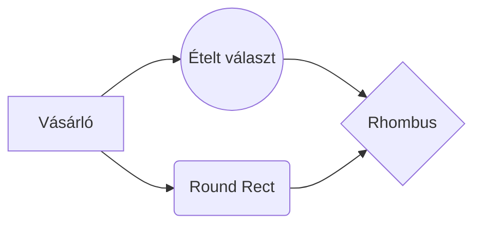

# Követelményspecifikáció

Ez a követelményspceifikáció az ügyvezetővel készült riport eredménye, még további pontosításra szorul.

# 1. Áttekintés

Egy gyorsétteremlánc számára készítünk mobiltelefonos applikációt Android és IOS rendszerre egyaránt. A program fő funciója, hogy a törzsvásárlóknak egyedi kedvezményeked adhasson az étterem központja, amit az országban bármelyik elfogadóhelyénb érvényesíthetnek, de csak egyszer fejenként. Ezeket az ajánlatokat számítástechnikában felhasználói szintű készséggel rendelkező munkatárs fogja aktiválni. 

# 2. Jelenlegi helyzet

Jelenleg semmiféle hasonló rendszer nem működik.
A vásárló bemegy az étteremlánc egyik üzletébe, válszt a menüről, fizet és távozik.

# 3. Vágyálom rendszer

Lorem ipsum dolor sit amet, consectetur adipiscing elit. Donec scelerisque, ipsum ac viverra fermentum, sapien augue convallis massa, eget eleifend ex magna in ipsum. Integer finibus consequat erat ut hendrerit. Etiam a velit ac dolor convallis porta. Ut vestibulum mollis tincidunt. Quisque eu sem at odio efficitur convallis ac placerat ligula. Aliquam scelerisque est metus, eu facilisis ligula sagittis sit amet. Praesent condimentum mi sed tellus imperdiet dignissim. Maecenas tristique lectus suscipit eros cursus pharetra. Mauris scelerisque blandit neque, nec pellentesque justo ullamcorper eget. Pellentesque feugiat rhoncus ante, sed blandit nulla pretium sit amet. Nullam auctor fermentum purus, posuere dignissim massa luctus eget. Vivamus interdum diam enim, egestas cursus quam porta et. Morbi bibendum dui ut lectus semper accumsan.

# 4. Rendszerre vonatkozó törvények, szabványok, ajánlások

**4.1. Szerzői jogszabályok:**

-   A törvény szerint az eredeti számítógépes program az azt létrehozó személy vagy vállalat szellemi tulajdona. A számítógépes programokat szerzői jogi törvény védi, amely kimondja, hogy az ilyen művek engedély nélküli másolása törvénybe ütköző cselekedet. (Magyarországon a szerzői jogokat az 1999. évi LXXVI. törvény szabályozza)
-   Licenszerződés(amennyiben van)

**4.2. Adatvédelmi jogszabályok:**

-   AZ EURÓPAI PARLAMENT ÉS A TANÁCS (EU) 2016/679 RENDELETE (2016. április 27.) a természetes személyeknek a személyes adatok kezelése tekintetében történő védelméről és az ilyen adatok szabad áramlásáról, valamint a 95/46/EK rendelet hatályon kívül helyezéséről (általános adatvédelmi rendelet)
-   MMXI. évi CXII. törvény az információs önrendelkezési jogról és az információszabadságról ( Infotv.)

Lorem ipsum dolor sit amet, consectetur adipiscing elit. Donec scelerisque, ipsum ac viverra fermentum, sapien augue convallis massa, eget eleifend ex magna in ipsum. Integer finibus consequat erat ut hendrerit. Etiam a velit ac dolor convallis porta. Ut vestibulum mollis tincidunt. Quisque eu sem at odio efficitur convallis ac placerat ligula. Aliquam scelerisque est metus, eu facilisis ligula sagittis sit amet. Praesent condimentum mi sed tellus imperdiet dignissim. Maecenas tristique lectus suscipit eros cursus pharetra. Mauris scelerisque blandit neque, nec pellentesque justo ullamcorper eget. Pellentesque feugiat rhoncus ante, sed blandit nulla pretium sit amet. Nullam auctor fermentum purus, posuere dignissim massa luctus eget. Vivamus interdum diam enim, egestas cursus quam porta et. Morbi bibendum dui ut lectus semper accumsan.

# 5. Jelenlegi üzleti folyamatok modellje

#  6. Igényelt üzleti folyamatok

Lorem ipsum dolor sit amet, consectetur adipiscing elit. Donec scelerisque, ipsum ac viverra fermentum, sapien augue convallis massa, eget eleifend ex magna in ipsum. Integer finibus consequat erat ut hendrerit. Etiam a velit ac dolor convallis porta. Ut vestibulum mollis tincidunt. Quisque eu sem at odio efficitur convallis ac placerat ligula. Aliquam scelerisque est metus, eu facilisis ligula sagittis sit amet. Praesent condimentum mi sed tellus imperdiet dignissim. Maecenas tristique lectus suscipit eros cursus pharetra. Mauris scelerisque blandit neque, nec pellentesque justo ullamcorper eget. Pellentesque feugiat rhoncus ante, sed blandit nulla pretium sit amet. Nullam auctor fermentum purus, posuere dignissim massa luctus eget. Vivamus interdum diam enim, egestas cursus quam porta et. Morbi bibendum dui ut lectus semper accumsan.

# 7. Követelmény Lista

Lorem ipsum dolor sit amet, consectetur adipiscing elit. Donec scelerisque, ipsum ac viverra fermentum, sapien augue convallis massa, eget eleifend ex magna in ipsum. Integer finibus consequat erat ut hendrerit. Etiam a velit ac dolor convallis porta. Ut vestibulum mollis tincidunt. Quisque eu sem at odio efficitur convallis ac placerat ligula. Aliquam scelerisque est metus, eu facilisis ligula sagittis sit amet. Praesent condimentum mi sed tellus imperdiet dignissim. Maecenas tristique lectus suscipit eros cursus pharetra. Mauris scelerisque blandit neque, nec pellentesque justo ullamcorper eget. Pellentesque feugiat rhoncus ante, sed blandit nulla pretium sit amet. Nullam auctor fermentum purus, posuere dignissim massa luctus eget. Vivamus interdum diam enim, egestas cursus quam porta et. Morbi bibendum dui ut lectus semper accumsan.